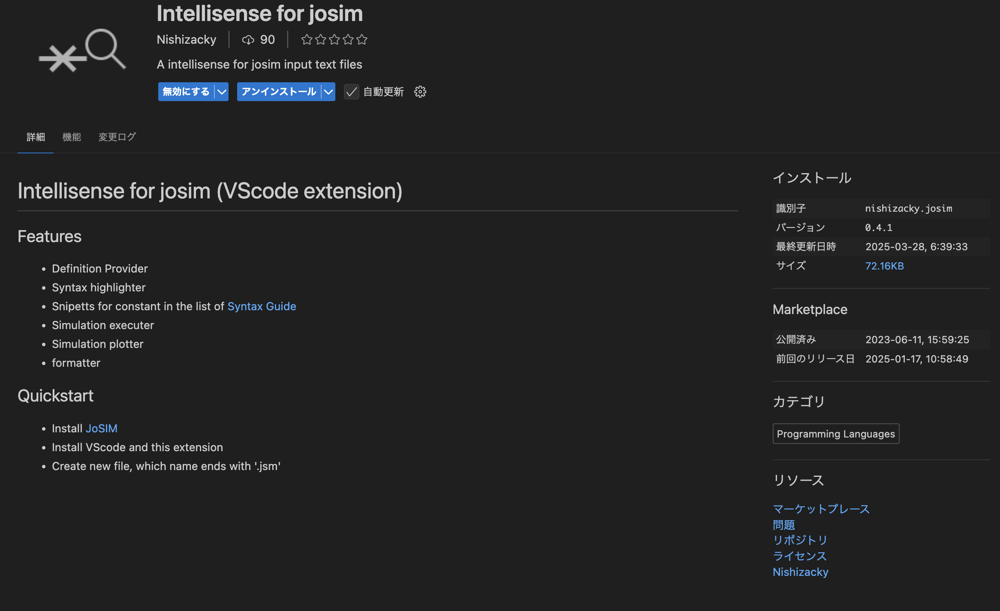
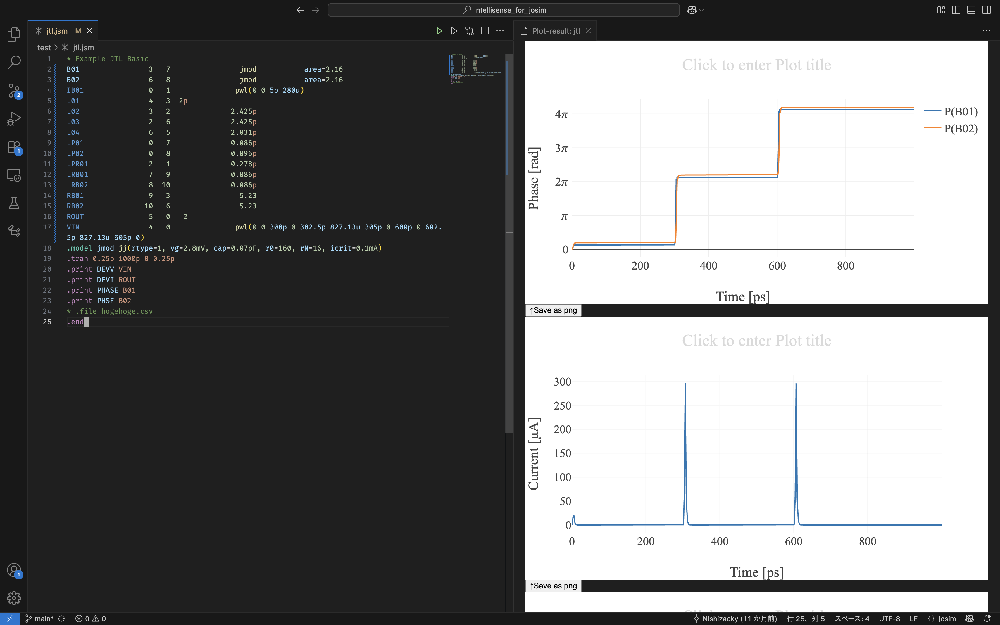

# Intellisence for JoSIM 利用ガイド
- [Intellisence for JoSIM 利用ガイド](#intellisence-for-josim-利用ガイド)
  - [導入の仕方](#導入の仕方)
  - [主な用途](#主な用途)
  - [FAQ](#faq)
    - [拡張機能をインストールしたが、何も起きない、再生ボタンも出てこない](#拡張機能をインストールしたが何も起きない再生ボタンも出てこない)
    - [よくわからないけど実行しようとすると警告が出る](#よくわからないけど実行しようとすると警告が出る)
    - [グラフを保存したい](#グラフを保存したい)
    - [グラフのコンフィグをいじりたい](#グラフのコンフィグをいじりたい)
    - [pngではなくsvgで保存したい](#pngではなくsvgで保存したい)
    - [画像タイトルを追加したり、凡例の各線の名前を変更したい](#画像タイトルを追加したり凡例の各線の名前を変更したい)
    - [間違えてプロットのウインドウを消してしまった、開き直す方法はないか](#間違えてプロットのウインドウを消してしまった開き直す方法はないか)
    - [直近のデータは5件以上保存することができるか](#直近のデータは5件以上保存することができるか)
    - [もう少し詳細にグラフを変更することはできるか](#もう少し詳細にグラフを変更することはできるか)
    - [windowsだとエラーが出る？](#windowsだとエラーが出る)

## 導入の仕方
1. VScodeでこの拡張機能をインストールします
   - 拡張機能ストアで「josim」と検索すれば出てくると思います
   
1. コマンドラインでjosim-cliが実行できるように環境構築をしてください。
   - windowsの場合は環境変数のパスを通す必要があるので気をつけてください
2. 利用したいファイルの拡張子を **.jsm** に変更してください。これがこの拡張機能がアクティブになる条件です。
3. Ctrl＋Enterあるいは右上の緑色の再生ボタンを押すことでJoSIMが実行され、実行結果が右窓に表示されることができます。

## 主な用途
1. 出力結果を自動的に右側ウインドウに表示します
2. ソースコードのシンタックスハイライトがされます
    - （不完全なのでたまに変なハイライトがかかります）
3. plotlyでグラフを表示するので、いらない線を削除したり拡大したり、マウスオーバーで数値を確認することができます。
   

## FAQ
### 拡張機能をインストールしたが、何も起きない、再生ボタンも出てこない
該当ファイルの拡張子を.jsmにしましたか？.jsmとすることでこの拡張機能は起動します。
### よくわからないけど実行しようとすると警告が出る
- 文法エラーを代わりに表示しているので詳細が知りたい場合は直接JoSIMを起動させてエラー箇所を確認してください
### グラフを保存したい
- スクリーンショットでもいいですが、グラフの左下に「↑Save as png」とあるのでそれをクリックすると保存します（デフォルトではダウンロードフォルダに保存されます）
### グラフのコンフィグをいじりたい
- 画像サイズやフォントサイズは設定から変えることができます。設定を開いて、よく使う項目＞拡張機能＞IntellisenseForJosim から設定を変更し、コマンドパレットから拡張機能の再起動をすることで設定が反映されます。拡張機能ではなくVScodeそのものを再起動しても反映されます。
### pngではなくsvgで保存したい
- svg形式にすることでいくら拡大しても画像が滑らかなままなので、プレゼン資料や論文にはsvgがおすすめです。よく使う項目＞拡張機能＞IntellisenseForJosim から保存する画像の拡張子を変更し、拡張機能の再起動をすることで反映されます。
### 画像タイトルを追加したり、凡例の各線の名前を変更したい
- 各項目はクリックすることで名前を編集することができます。名前を変更すれば画像を保存したときに変更した内容そのままで画像が保存されるので後編集の必要がありません。
### 間違えてプロットのウインドウを消してしまった、開き直す方法はないか
- 直近の５枚までは保存されています。元の画像はHTMLなのでwebブラウザで開くかVScodeの拡張機能であるlive previewによって同じ画像を再び開くことが可能です。保存ファイルはjosim_resultCSVフォルダが生成されその中に保存がされています。
### 直近のデータは5件以上保存することができるか
- 設定から変更することができます。しかし大きなファイルのためサーバーのストレージを圧迫させないためにも極端に増やすことはお勧めしません。
### もう少し詳細にグラフを変更することはできるか
- plotlyはHTMLによって書かれているため、josim_resultCSVから該当ファイルを取り出し中のHTMLを書き換えることでさらにグラフを変更することができます。あるいは同時に保存されているCSVファイルからプロットをすることが可能です。
### windowsだとエラーが出る？
- ファイル作成のパーミッション関係でどうやら上手くいかないことがあります。wslでの利用あるいはLinuxサーバー等での実行を推奨します。
